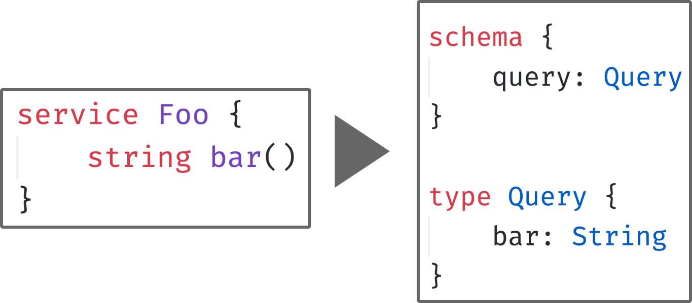

# ThriftQlEx



ThriftQlEx converts Thrift IDL into GraphQL SDL. Inspired by [AirBnBs approach](https://medium.com/airbnb-engineering/reconciling-graphql-and-thrift-at-airbnb-a97e8d290712).

Usage:

```Elixir
 mix thrift_ql_ex.gen --thrift schema.thrift --out schema.graphql
```

## Installation

Add `thrift_ql_ex` to your list of dependencies in `mix.exs`:

```elixir
def deps do
  [
    {:thrift_ql_ex, github: "sambou/thrift_ql_ex"}
  ]
end
```

## Docs

You need to create docs yourself via `mix docs` until the package is published to Hexdocs.

## Conversion Decisions / Type Parity

Thrift and GraphQL have similar type systems, but certain concepts from Thrift don't have a correspondence in GraphQL. Below is a list of decisions that were necessary to support certain Thrift features:

- Enums do not keep values from Thrift, their value is the defined constant
- Thrift sets are represented as GraphQL lists
- Typedefs only work for scalar values
- Mutations can be added via a Thrift annotation (`string foo() (mutation)`)

## Open topics

- [ ] handle Maps
- [ ] deal with Services, Namespaces and naming conflicts
- [ ] include descriptions and deprecations
- [ ] implement directive for automatic resolution via Thrift client
- [ ] generate input objects
